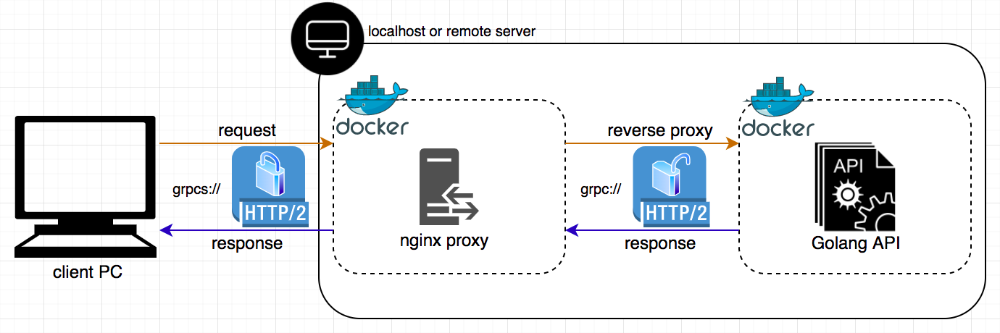

# Service Mesh with gRPC & nginx



## Demonstration


## Requirements

- Docker   20.10.8
- go        1.15.6
- libprotoc 3.14.0

## Quick Start

### Run Containerized API Server (Exec by Terminal No.1)

```bash
$ chmod +x certificates.sh
$ ./certificates.sh
$ docker-compose up --build
```

### Request from Client (Exec by Terminal No.2)

```bash
$ chmod +x client/request.sh
$ client/request.sh
```

## Clean Up

### Terminate Containerized API Server (Exec by Terminal No.2 or others)

```bash
$ docker-compose down
```
